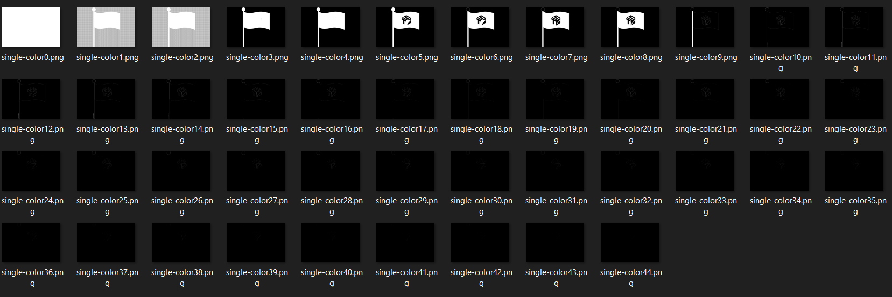

# STACK-the-Flags-2020-Where-s-the-Flag-Image-Color-Steganography
STACK The Flag CTF - Miscellaneous Challenge 7: Where's the Flag. This Repo focuses on the second part of the flag extraction


## Introduction
This is a partial solution to Where's the Flag in GovTech's STACK the flag CTF 2020. The first part of the solution requires one to extract a .png file from within another .png file. image0.png in this repo is the extracted .png file, which contains the flag, requiring steganography technique to expose the flag. 

This solution is adopted from [Plaid CTF 2014: doge_stege write up by Steven of the HacknamStyle CTF team](https://github.com/ctfs/write-ups-2014/tree/master/plaid-ctf-2014/doge-stege).

## Usage
Simply run ```python "Image Steg.py"```, there will be an interactive menu for you to navigate and choose an image and methods!


## Original Image
Original      |  Post-Processing
:-------------------------:|:-------------------------:
 |  

## Functions of .py script

Let 0 denote palette entry set to black (0x000000), 1 denoting palette entry set to white (0xFFFFFF)
| Functions   | First Image | n/2 Image | Last Image | 
| ----------- | ----------- | --------- | ---------- |
| Function 1  | 100000000   | 000010000 | 0000000001 | 
| Function 2  | 000000000   | 111110000 | 1111111111 |
| Function 3  | 111111111   | 000001111 | 0000000000 |


### Function 1: Expose One Palette Entries at a time

This function will first clear all color palette entries to black, then set only one palette to be white in each iteration (Think of principle of one-hot, where only one palette can be white at each iteration)


### Function 2: Gradually Expose All Palette Entries

This function will first clear all color palette entries to black, then gradually set each palette entry to white, until all entries are white. 


### Function 3: Gradually Remove All Palette Entries

This function will first set all color palette entries to white, then gradually clear each palette entry to black, until all entries are black. 


### Remarks
For STACK the flag CTF 2020 competition, Function 1 was sufficient to retrieve the desired result. 

However, when I revisited [Plaid CTF 2014: doge_stege Write Up](https://github.com/ctfs/write-ups-2014/tree/master/plaid-ctf-2014/doge-stege), I realize that that particular CTF concealed the flag using multiple palettes. Hence, Function 2 and 3 were implemented for completeness' sake. Below is Plaid CTF's solution using Function 2. 
Original      |  Post-Processing
:-------------------------:|:-------------------------:
  |  
 
